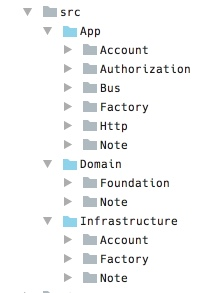
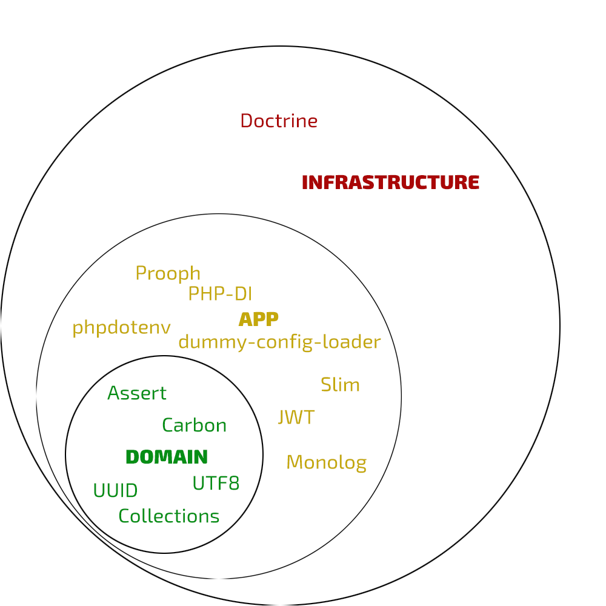

- slug:clean-architecture-implemented-as-a-php-app
- date:Apr 30, 2017 22:05
# Clean architecture implemented as a PHP app
Hi! Having worked with Laravel for a few years, I found myself in a pool of "laravelish" ways of doing things. The Laravel way is easy to start and easy to make progress. 

However, after joining few teams with old Laravel-based apps I found that it's hard for me to make a progress in there. The code was messy and unreadable while still looking very Laravelish. It was not so trivial to see a better way of organizing code. 

So I told my self - what are the alternatives to Laravelish approach (i.e. highly coupled)? And it turned out that there was quite an alternative. 

## TL;DR;

* Repo backend: [GitHub Repo](https://github.com/lezhnev74/ema)
* Repo frontend: [GitHub Repo](https://github.com/lezhnev74/ema-web-client)
* Demo: [Link](https://ema.lessthan12ms.com/)

## Clean architecture 
I found out this "comparison" of different architecture styles (originally from Ruby world) which fit the situation: [TDD Harms Architecture](http://blog.cleancoder.com/uncle-bob/2017/03/03/TDD-Harms-Architecture.html):

* one is advocated by DHH (which is also offered as "the Laravel way")
* the clean architecture is advocated by Uncle Bob and people like Jim Weirich

The latter approach basically says that your "application guts" should be isolated from your framework (Laravel or Rails) and should not be aware of it. 

See the arrows? They mean "aware of", so outer layer are aware of the inner layer, but not vice versa.

But how easy it is to implement real Clean Architecture in PHP or Ruby? In [his talk](https://www.youtube.com/watch?v=tg5RFeSfBM4) Jim says: 
> I've implemented that [clean architecture] from scratch in a simple Rails project. And it is horribly complicated.

Jim's opinion to start coding in rails ASAP and then incrementally fix arising problems (with the growing codebase) is viable. He is against the making upfront architecture and proponent of agile and refactoring. 

Anyways, I thought to made some efforts to get deep into the Clean architecture. There are very limited open sourced apps following Clean Architecture. It is hard to learn from the other people's real work.

## PHP community looks for ways to build better software
I believe that TDD + Clean Architecture is the way we must build our apps as craftsmen. I understand that simple laravel style is a great way to get the job done. And for the most basic things, it is. When project evolves, I've seen what the "easy laravel" approach leads to.

People are searching for ways to better code structure:

* [Lucid architecture for Laravel](https://github.com/lucid-architecture/laravel#getting-started)
* [Implementing the Clean Architecture](https://www.entropywins.wtf/blog/2016/11/24/implementing-the-clean-architecture/)

As well as I am thinking about better ways to organize my code constantly:

* [One step towards clean architecture from rapid application development](https://lessthan12ms.com/one-step-towards-clean-architecture-from-rapid-application-development/)
* [Clean exceptions with logging and translation](https://lessthan12ms.com/clean-exceptions-with-logging-and-translation/)
* [My PHP code structure should tell you what it does – or how do I show project’s intents to my teammates?](https://lessthan12ms.com/my-php-code-structure-should-tell-you-what-it-does-or-how-do-i-show-projects-intents-to-my-teammates/)

## The app is written in PHP following the Clean Architecture style
I've decided to make an app by following clean architecture ideas as much as I can. I used no framework like Laravel or Symfony or Zend. Instead, I made my app from the quality packages available on the GitHub.

It is "Extended Memory App". I usually need to make a note with no delays and find it later with fast search (kind of putting the information out of the mind but easily accessible later).

Links:

* [Repo backend](https://github.com/lezhnev74/ema)
* [Repo frontend](https://github.com/lezhnev74/ema-web-client)
* [Demo](https://ema.lessthan12ms.com)

I started with splitting my app into 3 layers:

* App
* Infrastructure
* and Domain

### Domain layer

This separation is supposed to communicate what this app is about. The "guts" of the app (read Domain) have two "contexts" - account and notes. This is trivial - accounts can manage their notes.

In this app, there are not much business rules and Domain layer is also thin enough.

### App layer

This layer is supposed to manage user interactions via HTTP requests and responses. It also configures and uses service bus to orchestrate communication.
Following common sense, I put Read models (read Queries) in here also. Queries are reading operations which do not affect the state of the app and may return different formats as a response. Thich is all about how the user communicates with the app.

### Infrastructure layer

Here I put Doctrine implementations of different collections and finders.  This layer is relatively thin because it's the only purpose is to have detailed implementation of database IO.

### PHP packages

See composer.json for details. The is the overview:

### My personal feelings about this app

* **Domain layer**
I enjoyed writing details-free domain layer. Here I think in terms of domain models, what public API should look like. I don't care about details and implementation of storage, I only design public APIs and protect business invariants.

* **TDD**
When I needed to implement next feature from the backlog - I had some hard time thinking it through. How it should fit in the app structure, what classes\details\abstractions I need to add, can I reuse anything? It is dramatically different from the "just do it" way I tend to see in Laravel.
Having few layers I will also have few layers of tests. One will make sure domain logic works as expected, other tests will make sure app layer accepts and validates user requests and produces valid responses.
Moving to a solution from the tests is something strange. Usually, you have a problem and you naturally see the code block that will solve it. You write that block and thats it, problem solved. But this is not how I should work - first, I need to make a test which will make sure that system given input produces valid output, then I should write code which will pass the test. 
Low barrier to writing RAD apps (in Rails or in Laravel) gives you an impression that any problem can be solved with just a few lines of simple code. Which leads to the big ball of code snippets.
I had to write a [code generator](https://github.com/lezhnev74/ddd-generator) because every command I add requires few files and also tests. It is not pleasant to do manually.

* **Clean architecture** 
Speed. Speed of implementing every new feature is reduced compared to my previous just-do-it coding. After practicing Laravel I had to slowly think through each step I make, Uncle Bob just outlined the shape of clean architecture, so details I had to discover myself. 

* **App layer**
From my experience, most of the work I did on this layer. Starting from HTTP IO, authorization, making read models, error handling and much more. I feel that this is where framework or just good packages will fit just fine. Don't reinvent the wheel here, "Slim" will cover your HTTP IO channel, "Prooph" will route your data etc. 
But I don't think that full-fledged framework will be a good choice here because it will also bring its coupled nature.
I enjoyed using standalone packages because it feels like Unix inspired development. Each part of the program is handled by a small module. It is not about replacement, I doubt that I will change Slim to Zend Expressive anywhen. But it is about using the right tool for the job. Considering requirements and particular case I will choose the right package.

### Closing thoughts
I love standardization. Arguably this is one of the good parts of any popular framework. It explicitly tells you where to put different things and how to arrange your code. This is enjoyable because you don't have to think about it. You kind of gave this responsibility to framework's creators. And when you work with the known framework you know what to expect.  While this is "good", people often take a framework read documentation samples and don't think any further. That's why too often a lot of the code ends up in the controllers - no one told me any other way of doing it, right?

So, I think this is where work needs to be done. The community should agree on some best practices. When you say "clean architecture" people must understand how it should work and what to expect. 

I loved working with PSR standards. Autoloading, container, middlewares are just perfect. A lot of code can be found on GitHub that can be easily integrated into the app.

## References
- [Clean architecture links](https://lessthan12ms.com/clean-architecture-links/)
- [Think frameworkless](https://lessthan12ms.com/think-frameworkless/)
- [Authorization and authentication in clean architecture](https://lessthan12ms.com/authorization-and-authentication-in-clean-architecture/)

