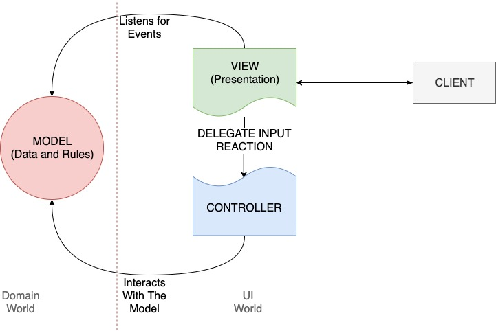
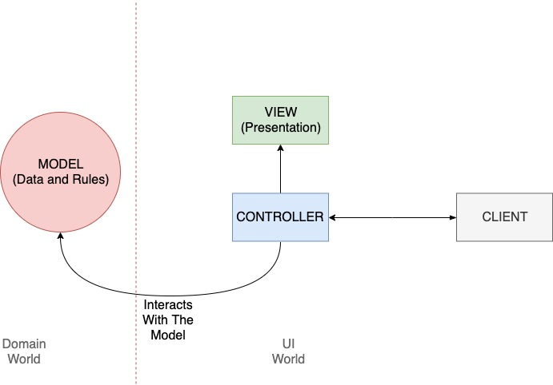

- slug:mvc
- date:5 Nov 2019, 08:00
# MVC and the Web
I am trying to use words correctly. At some point, I realized that the term MVC is a bit obscure to me. Let's find out
what it is together. 

The term MVC is essential for us web developers. But what does it mean? Where did it come from? How to use it properly?

## The Origins Of The Term
In the late 70s (as well as now) developers tried to come up with a practical design solution that would allow them to
maintain software systems. MVC is one of the ideas. Back then it was a way to write maintainable GUI based desktop
software. It decouples UI from the domain logic, and within UI it decouples output from input (presenting from
reacting).

{style="max-width:100px;text-align:center;"}

The idea was coined by **[Trygve Reenskaug](https://www.wikiwand.com/en/Trygve_Reenskaug)** around 1979.

> He formulated the model–view–controller (MVC) **pattern for graphical user interface (GUI) software design** in 1979
> while visiting the Xerox Palo Alto Research Center (PARC). 

— According to Wikipedia.

Initially, the pattern set rules for designing real-time applications running on desktops.

> At the heart of MVC, and the idea that was the most influential to later frameworks, is what I call Separated
> Presentation. The idea behind Separated Presentation is to make a clear division between domain objects that model our
> perception of the real world, and presentation objects that are the GUI elements we see on the screen. 

— [GUI Architectures by M.Fowler](https://martinfowler.com/eaaDev/uiArchs.html)

### Model 
The Model is an abstraction that represents objects of the business, the real world things (think of bank accounts,
products in stock, employees, and salaries). It encapsulates data and business rules which govern the change of the data
(for example, calculation of the interest in banks or marketing discounts in retail software).

The model does not know about the UI. It knows nothing about how we present it to the end-user. It does not care about
colors, screens, keyboards, etc. Only core business rules matter here.

### View And Controller
The view is an abstraction that shows the model to the end-user. It renders somehow the model's data on the visual
medium. The view always represents the actual state of the model. So if at any moment the model changed, the view
changed. To achieve that the View would subscribe to the changes of the model (think of Observer pattern). As you can
see it is a real-time communication, a stateful system.

The view uses Controller to react to the user input. It delegates a reaction strategy to controllers. This is done
intentionally to decouple responsibilities. The view can switch controllers to change the behavior at any time (see
Strategy pattern).

The controller reacts to user input and it is possible that it can change the model, which would notify the view about such
changes and view would update the UI. And so we see the closed-loop of the app.

As you can see, View and Controller are used together to render UI and to react on input from the user. They belong to
the UI world. They depend on Model (see that arrows cross the red line in just one direction - the model does not know about
the UI)

## The Web
Since then we saw the exponential growth of the Internet and the Web. Web applications are practically different from the
desktop ones. The difference is in the stateless foundation of the Web - HTTP protocol. We send requests, wait for
a response and that's it, the connection is closed. 

On the web, we use Client-Server architecture, which implies that UI(the frontend) and the backend are located on
different nodes of the net. They do not share the same memory in runtime, and thus UI is stateless. So **that is not MVC
as was explained by Trygve Reenskaug**.

### JSP Model2

On the Web, we still want to decouple domain logic (the model) from the UI (the view and controllers) and MVC ideas
transformed to something called [JSP Model2](https://www.wikiwand.com/en/JSP_model_2_architecture). Model1/2 were just
a couple of approaches to how one could use JSP. **It is happened to be that Model2 was a natural evolution of the MVC for
the Web.**

> In a Model 2 application, requests from the client browser are passed to the controller. The controller performs any
> logic necessary to obtain the correct content for display. It then places the content in the request (commonly in the
> form of a JavaBean or POJO) and decides which view it will pass the request to. The view then renders the content
> passed by the controller. 

— Wikipedia

Even though the terms sound the same, their roles are different.

    <table>
        <thead><tr><th>Term</th><th>MVC</th><th>Model2</th></tr></thead>
        <tbody>
            <tr>
                <td style="text-align: right; padding-right:20px;font-weight: bold;">View</td>
                <td>Observes the Model in runtime. When model changes, it changes instantly.</td>
                <td>A passive logic which renders given data once. Does not maintain any links to Controller or Model.</td>
            </tr>
            <tr>
                <td style="text-align: right; padding-right:20px;font-weight: bold;">Controller</td>
                <td>View delegates handling user input to the Controller. The controller listens for input and decides how to react to it. It can affect the model.</td>
                <td>Accepts requests from the user, decides how to react on them. Chooses which model to use and which view to render.</td>
            </tr>
            <tr>
                <td style="text-align: right; padding-right:20px;font-weight: bold;">Model</td>
                <td>Domain logic which must be presented to the end user.</td>
                <td>Not described. It is something that gives data for
    visualisation.</td>
            </tr>
        </tbody>
    </table>

## MVC In The Modern Web Development
Modern frameworks for the Web, starting from Apache Struts, down to Ruby on Rails and PHP Laravel. All incorporate ideas
described in JSP Specification 0.92. The problem that Model2 solves is the same as MVC but applied to the distributed world
of the Web. 

Both designs don't explain much about how the Model is implemented or designed. They both allow anything to act as a model, 
the only thing they say is that the model should be UI independent and be not aware of it.

## Sum up
- MVC was coined by Trygve Reenskaug around the late 70s while he was working at the XEROX PARC.
- MVC suggested architecture for GUI desktop applications
- Later JSP Specification 0.92 introduced Model1/2 designs. Model2 was highly based on MVC but adapted for the Web.
- Current Web development is based on Model2 and not really on MVC even though the term is used interchangeably.

## References
- [The JSP 0.92 Spec which coined Model1/2 terms](http://www.kirkdorffer.com/jspspecs/jsp092.html#model)
- [Understanding JavaServer Pages Model 2 architecture](https://www.javaworld.com/article/2076557/understanding-javaserver-pages-model-2-architecture.html)
- [The Model-View-Controller Design Pattern: `Model 2` JSP Development](http://ptgmedia.pearsoncmg.com/imprint_downloads/informit/chap2_0672324725.pdf)
- https://struts.apache.org/primer.html
