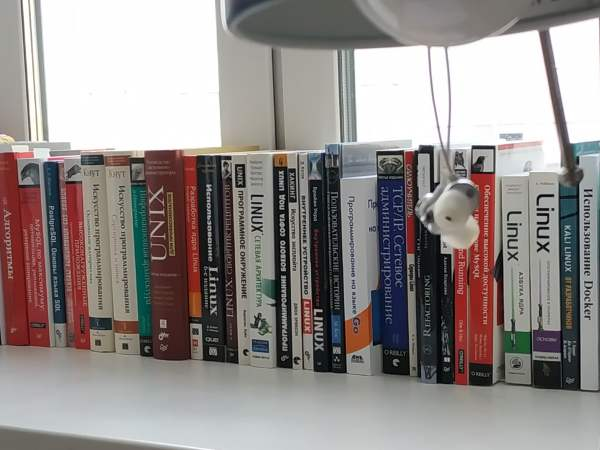

- slug:affordable-custom-development-php
- date:1 Dec 2019, 12:00
- unlisted: yes
# Need PHP Expert?

## Let Me Introduce Myself

**I am Dmitriy Lezhnev.** I live in
[Russia, Yekaterinburg](https://www.google.com/search?q=yekaterinburg&oq=yekat&aqs=chrome.0.69i59j69i57j0l6.1435j1j1&sourceid=chrome&ie=UTF-8)
and develop web applications since 2010. My profile is PHP backend development of custom applications, the ones which
developed for a specific purpose (think of different SaaS tools or API-only apps).

 

I successfully passed [the Zend Exam](http://www.zend.com/en/yellow-pages/ZEND031138) hold by a company that
created PHP and leads its development nowadays.

 

 I keep a high bar for my coding discipline. I know what code patterns are, what clean architecture is and
how to test my code.

I write things about my work here in [the blog](/). You can also find me on
[LinkedIn](https://www.linkedin.com/in/dmitriy-lezhnev/), on [Github](https://github.com/lezhnev74) or on
[Twitter](https://twitter.com/dimalezhnev). I work in a remote fashion for years and maintain high work ethics with my
colleagues.

Send me a message to `dmitriy@lessthan12ms.com`. 👋

## Is this you?

1. You have an old PHP application that many developers worked on. This app works and brings money in but few can fix
   bugs or add new features because of the mess under the hood.
2. You need to validate your idea. So you need to build an app and see if it makes you money, but you have no team to
   develop and support it.

If any of that sounds correct to you, then I will be happy to work with you.

## High Standards Of Software Development

1. **Test Driven Development** Some developers get confused: *What part of the application do we need to test?*. The
   answer is certain: *Only those parts that you need to work*. Surgeons wash their hands before the surgery. I stay
   responsible for my work, I write tests for my code.
2. **Clean Architecture** I keep important business logic separated from low-level details like databases, delivery
   mechanisms, etc . Proper boundaries keep a system secured, well balanced and easy to test.
3. **Accumulated Best Practices** I build software designed specifically for the Web. Websites and Mobile apps
   communicate with the servers over the Internet. This is my home, my bread, and butter. I know what works and what
   doesn't, and I will gladly share it with you.
4. **Stable Pace** My experience gives me a good understanding of the speed of development. I keep the pace and deliver
   at a predictable time.
