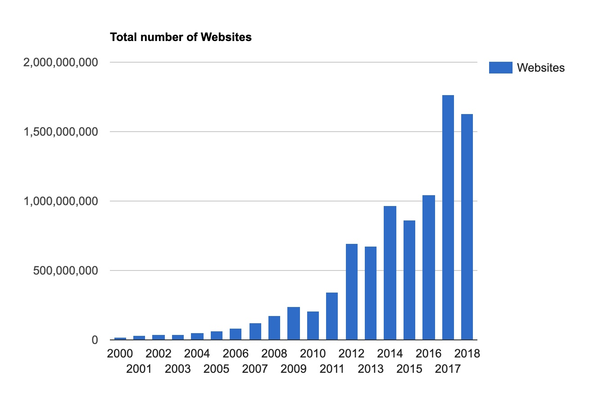
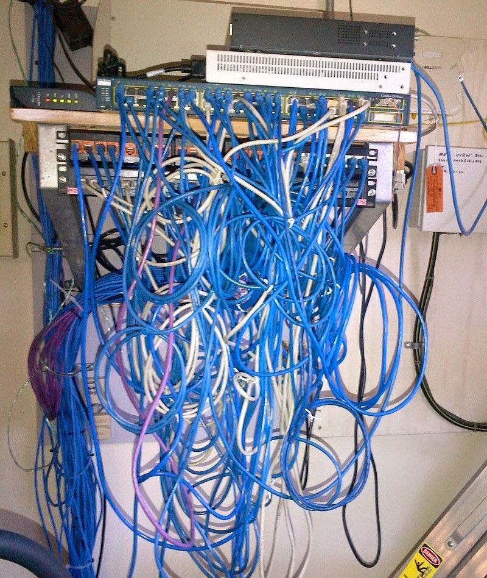
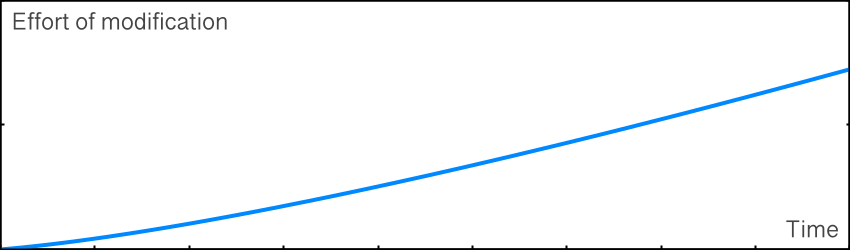
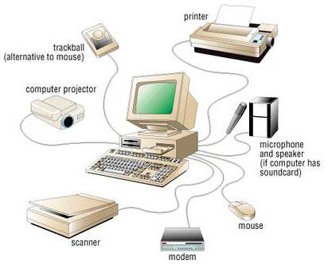

- slug:expensive-code
- date:21 Feb 2020, 08:00
# Expensive Code (Maintainable PHP Backend 1/3)

## What is the problem?

When we speak about the Web and web applications, we refer to an unprecedented phenomenon. The ecosystem of web apps
grows exponentially for years. The number of web programmers grows at the same pace. Online businesses appear nearly as
fast.

{style="max-width:600px;"}  
[source](https://www.internetlivestats.com/total-number-of-websites/)

The problem with the development of web products is that when you start, you already have a number of competitors
somewhere on the Web. The competition is insane, at least that is what our clients think. Clients want products to be
live asap, and they want to publish new features at the same speed. That is happening because the market is shared by
numerous products and to secure a market segment, one needs to act fast. Given that observation, let's review what is
going on on the backend (that is where we spend most of our time as developers).

Web apps are clearly divided into two parts: a visible and a hidden. UI is a visible one, it gets the most attention by
clients and by users. It is tweaked and designed very carefully. And it is usually the most expensive part of simple web
apps (like blogs and simple e-shops). The hidden part is the backend. It is seen by no one but developers, no one except
developers cares much about it, no one justifies costs that well-designed backend requires. Again, clients tolerate time
taken to carefully design the UI but do not tolerate time taken to carefully design the backend.

But guess what, no business went bankrupt because of the wrong button color, but some did because of wrong business logic.
Guess where the wrong logic was found - you bet, on the backend. Hacks, leaks, thefts and so on are possible because of
poor development practices, poor discipline.

Since clients don't care about the internal code quality, developers are encouraged to take short cuts so they can
deliver faster. That gives us a short boost in productivity. But we accumulate a so-called technical debt. What is it?
It is time one needs to evaluate the code and understand how it works, so they can fit a new feature in. Quick solutions
is a lack of design discipline which leads to bad code.

Cables can be arranged differently as seen in pictures. Let's imagine both systems work well. The question is: what
system can be changed with less effort and less risk?

<table>
<tr>
<td>

</td>
<td>

</td>
</tr>
</table>

We, developers, have to explain to clients why the code design and time that we spend on testing, refactoring and
tweaking the internals are well worth the cost. In the long run, it pays off. It is not enough to jump in the market and
take a piece of it, what matters is a stable pace of holding and extending the market share by delivering new features
to customers.

## Expensive Bad Code Design

It is known that most of their time developers spend on changing existing code, not creating a new one. That is true
because to implement a new feature you have to understand how the current code works and how to fit a feature in. Quick
solutions lead to the code that is hard to change, but we know that changes are inevitable. The graph represents a
simple idea of increasing time to change the code:

{style="max-width:400px;"}

It happens like this, we need to implement a new feature quick, so we hack in the existing code, add patch here and
there and ship it (everybody is happy). Hacking involves interconnecting of different parts of a system, skipping the
testing part and, in general, not thinking much about how the hack affects the system in general. Tomorrow we need to
implement another feature, we hack a little more. The other day another developer needs to work on the code, so he adds
his patches and when you come back to the code it looks quite hard to understand and infer it's intent. Without proper
discipline, the code becomes interconnected and fragile.

Sadly it is a common practice when we change something in one part of the system, another one breaks for no clear
reason (Well, the reason is actually clear. Somebody decided it'd be quicker to interconnect the two parts so now they
can't be changed independently). We call such systems fragile. This is happening when parts of the system are not isolated.
You can think of global variables, shared memory, unchecked dynamic types, etc. Things that harm isolation.

To fight fragility we need to be careful with the side effects of each part of the system. One good example of a fragile
design is the connection between UI and databases by exposing table schema column names to UI templates. Doing so one can
get quick results but they miss the whole picture of consequences of such choice. Schema and templates can no longer
evolve independently, changes to one piece will affect another, guaranteed.

It is naturally not just our desire to have a nice code, **it is the economic reality where bad code leads to fewer
features (and more bugs)**. If for some reason, clients forced developers to take short cuts and produce bad code, they
will pay later when the will need new features that no one can build at the same pace as before.

The only truth in software development is the fact that requirements change. Our very goal is to design a system that
suffices current requirements and is soft enough to adapt to future changes. In other words, we should keep one question
in mind - **how easy it will be to understand this system in the future**?

> Any fool can write code that a computer can understand. Good programmers write code that humans can understand.
>
> *Martin Fowler*

We can't justify our poor decisions by a lack of time. We can't afford to be short-sighted. Quick solutions are good for
"here and now", but if you think about the future, how this system will be changed by somebody else, you realize that
you should've made different decisions.

What if all developers who work on a system favor quick solutions, how maintainable the system will get in weeks? How do
we organize teamwork so we get a well-designed system, and future changes do not require a lot of effort? What rules
does each developer follow in their work as individuals?

Speaking of rules. How often do we follow our intuition when we design our code? The intuitive approach is no more than
a lack of discipline. Ask two developers about how to implement a feature. How likely you'll have two different answers?
Do we, as developers, have a standardized discipline to build software? The one that produces systems a new developer
can easily understand?

## Discipline To Write Code

What is discipline? Some sources define it as a practice to obey rules. Sounds correct? Why do we obey rules? To get
predictable outcomes out of our activities, and avoid unwanted ones. And we really want to get predictable outcomes in
software development.

Software development as a discipline exists since the 1940s. Its pioneer Alan Turing wrote in 1947:
> One of our difficulties will be the maintenance of appropriate discipline so that we do not lose track of what we
> are doing.
>
> *Alan Turing, Lecture to the London Mathematical Society on 20 February 1947*

The man who basically invented programming thought programming was not easy. How do you feel about that?

## Complexity Management

Modern web backend is a complex system that consists of a lot of parts: authorization, queues, databases, I/O channels,
notifications, and a lot of business logic. Each part must seamlessly integrate with another. One poorly designed
sub-system brings the whole plane down. Speaking of planes... Do you know how modern planes are designed and built? Do
you think the whole plane is thought through by a single company? Let review a list of suppliers
[involved in development](http://www.airframer.com/aircraft_detail.html?model=B787) of Boeing 787 Dreamliner:

  
[image source](https://www.businessinsider.com/boeing-787-dreamliner-structure-suppliers-2013-10?r=US&IR=T)

How does Boeing manage such different companies so they produce compatible parts? Probably they provide them with
detailed specifications: sizes, weight, power, rules, etc. Companies develop solutions that suffice requirements. It is
impossible that each supplier knows everything about the plane design, they know only what they need to know in order to
ship their part.

**Modularity is a natural tool to reduce complexity**. Each module of a system does one thing and does it well, it
limits side-effects on the rest of the system. It also has some sort of interface to connect it to another module.
Each module knows only what it needs to know in order to be useful.

Let's see how computer peripherals are designed. How easy to fix a problem with a mouse? Replace one? Or clean up the
sensor. What if we change a printer to a new model, will the other parts of this system notice?

Back to software, to build a complex system we split it in pieces, and define interfaces between them. We test each
module independently to enforce that it does not behave incorrectly. From now on each piece is a small system itself and
it knows little (or nothing) of the outside world. Each piece can be designed, implemented, and changed by different
people at different times for different reasons. As long as the module suffices to the interface it can be easily
maintained as a black box. Time to understand this piece is much shorter, as you don't need to understand the whole
system at once.

We solve the problem of maintaining our backend code by building many small backend parts, that we can safely change
independently. Divide and conquer, have you heard that before?

## Sum It Up

The market is changing rapidly, so we are always in a hurry to claim our market share. That makes us change code
constantly. Well designed code allows us to spend less time to change it. No matter what clients think, it is cheaper in
the long run, more reliable to design a well decoupled, and tested code. It is our responsibility to keep our codebase
easy to understand. There are, of course, tools, and practices, and processes that help us. We will review them in
future texts.

## Follow-up Questions
- Why clients force us to deliver new software as fast as possible?
- Why understanding an existing system takes more and more effort through time?
- What is a quick solution in software development, what are cons and pros of applying them?
- What design approach can help us to limit complexity of a system?
