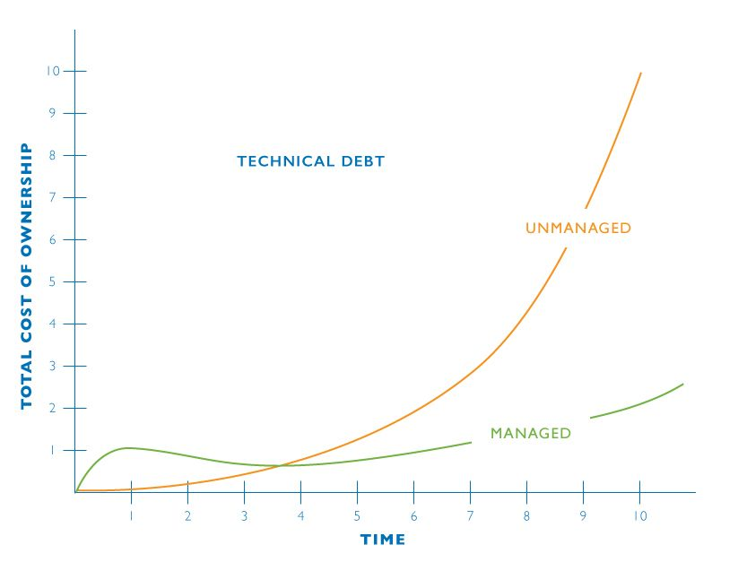

- date: 18 Feb 2023, 12:00
- slug: remote-teams-playbook

# Playbook for Remote Development Teams

## Practices to deliver high-quality code in the long run.

This list contains my distilled ideas that came from working in quite a few
teams and observing the industry, there are no two identical companies so I am
aware of my limited exposure and probable naiveness. However, these insights
came from my real experience and I can truly say that these things work and work
well. I have worn many hats. Worked many years as a contractor/freelancer, then
switched to small saas/mobile app startups (as CTO or a backend developer). I
enjoy the most working at the backend with only two tools open: my IDE and my
terminal (the rest is optional).

## Cultural fit:

> Would I enjoy spending time together with that person?

Humble and open-minded people that you enjoy working with are likely the most
important contribution to quality software. I am a bit of a code-nerd and not
good at hiring/interviewing (I don't enjoy it either), I am too demanding and
sometimes can't see a good person behind technical questions and answers. But
this is ok, other people around me get it. Our current CTO and CEO at shown.io
get this (Greg and Patrick, hey! ✋). I can't be happier with the team they
assembled and grateful they hired me after all :)

If the CEO/CTO/HR gets this right there is a good chance the rest will follow
just alright. However, even a mismatch will be obvious in a matter of months
thanks to the rest of this playbook.

## No Backlog

> Plan as you go.

You get knowledge/details as you work towards the goal. Ask questions, and
clarify as you go. The idea is that whenever we start to work on a feature, we
get into details and learn what it actually means to make it. At this point it
becomes clear the scope of the work, the longer one is working on a task the
more knowledge they are getting. After working for a while on a user story we get extra info by asking questions,
offering suggestions, and altering the original goal. This is a process. Often it becomes clear that the scope is too
big and must be reduced.

For example, "we need to add a payment system so users
buy subscriptions with different methods" is a good starting point. But later we
realize that there are many payment providers in different countries. By asking
questions we could reduce the scope to "add Stripe for credit card payments in
European Union". That is normal and happens all the time, we learn as we go,
share knowledge with peers, and adapt the scope and direction of work often.

## Developers Autonomy

> Define the goal, let them figure out the rest.

This follows the idea above. Start with a short description of what makes sense
to work on next. You don't know all the details right now and nor should try to
describe it all. "Add a payment system so customers can buy subscriptions in the
app" is a perfect start. We, developers, will dig into it and learn the actual
complexity of it and communicate our options, deciding what to do as we go.
Being a remote worker means we set our schedule, our way of work, and life. It
is the most healthy thing to get the freedom of how we do things and only
occasionally check in to ask questions or communicate progress (with respect to
other ideas in this playbook). This freedom enables creativity and efficiency.
We feel that we own our work, and we are trusted to do it well.

In a self-organized team the backlog is not required, the next thing to work on is always obvious.
It just emerges in discussions, code reviews and feedback from customers.

<blockquote class="twitter-tweet">
I do not do Scrum, so I have no need to estimate an increment/Sprint. I just work on the most valuable single story next. I pull that story, narrow it down to a set of &lt;= 2-day stories, pick the most valuable (of the most valuable 😄), and build that. 1/3
&mdash; Allen Holub @allenholub@mstdn.social (@allenholub) <a href="https://twitter.com/allenholub/status/1594391799547559936?ref_src=twsrc%5Etfw">November 20, 2022</a></blockquote>

## Share Knowledge And Progress

Since everyone is working autonomously and remotely, we need to create shared
"learning points" to grow together. From my experience be/weekly video calls
work best. We see each other, we talk, and discuss things we work on, what we
learned, what blocks us, what we need, and how we feel. Whether we should change
the scope of work. Talking is important as it shows the way of thinking of each
other, it shows where we struggle. We use screen sharing as needed to show some
code here and there, sometimes not. Also, this is one of the opportunities to
catch on falling behind developers (also see "Foreman"). If people work from
vastly different time zones that can be a challenge, but this shared talking
session is vital to do at least once a week.

Good equipment is vital (good picture and more importantly clear sound) to
express emotion and non-verbal details. So investing in those can really make a
difference.

## Clear Technical Standards And Expectations

Similarly to "cultural fit" shared technical values help to develop trust in the
team. Trust is key to long-term quality. These expectations and standards must
be clear from day one, so we can keep the technical debt under control.

{style="max-width:100%;"}
[source of image](https://ru.pinterest.com/pin/528398968767899882/)

I always thought of my "product" as a developer is that green line. 
This means that the amount of effort to change the code remains the
same no matter how big the system grows. That green line is hard to achieve and
that is why this playbook emerged. It is a process of making sure everyone on
the team understands why these goals, ideas, and practices are there. Constant
discussion of decisions we make in code for technical goals is a big deal.

- [DesignStaminaHypothesis](https://martinfowler.com/bliki/DesignStaminaHypothesis.html)
- [The Discipline Of Software Development](https://lessthan12ms.com/software-development-discipline.html)

## Supervised Onboarding

All these ideas and practices are to be developed in a new teammate, just like
in sports. An experienced person (see Foreman below) supervises a newcomer.
Explains the design approaches first, reasons about why and how. The first tasks
are small and well explained. Sometimes it makes sense to just dip the person in
the code, and let him dive himself. But even for experienced developers a gentle
curated introduction makes a big difference. The small scope of tasks, detailed
code review, and quick feedback.

## Foreman

Robert Martin articulated a well-defined role of a Foreman. OSS embraced this
role long ago, not everyone can freely commit to an OS project, and only those
who follow described quality rules do. The job of a foreman is to make sure
everything is done right and look for problems (constantly). Transparently
watching, taking corrective actions if needed, hints, pointing out weak spots.
Responsibility to see if some developers fall behind early.

In a team with truly shared values and developed trust, everyone acts as one.
And still, the formal responsibility of supervising the whole codebase can be
imposed on someone to spot a moment when something goes south.

[https://blog.cleancoder.com/uncle-bob/2014/02/27/TheTrustSpectrum.html](https://blog.cleancoder.com/uncle-bob/2014/02/27/TheTrustSpectrum.html)

## Multi-phase code quality control

We are professionals, we trust each other to do the best work and yet we have a
multi-step system that ensures code quality:

1. Local IDE checks Using a good IDE is vital, all the little convenient plugins
   it offers, all the hot-keys, highlighters, and smart auto-complete. I think
   arguably most of the essential code checks happen in our IDE.

2. CI/CD automatic checks (format, static analysis, green tests) CI/CD is a
   gatekeeper who won't tolerate bad code. We can let it test our commits, but
   usually, it is more convenient to run the checks locally before the push and
   save time.

3. Peer code review (someone has to take a look at all the new code). Whenever
   the automatic checks pass we need to let a real person take a look at the code.
   This is to spot hacky solutions that we sometimes do to save time, but
   accumulate technical debt. Usually, an observer can easily see when code
   violates SOLID principles.

4. Check by a foreman This is a final human glance over the code to keep it
   clean and solid. You as a developer might not always see that but that "glance"
   must be there.

## CI/CD

Automatic checks save a lot of time. Since all developers work autonomously we
need a central tool to merge branches into a single shippable software. This
tool does quick automatic checks on incoming PRs and ensures that accumulated
work does not break anything. Merging code to a main branch should be a
non-event, we make local checks first, make sure we are happy with it, and click
"push", the rest is handled by the tool.

This helps us have our app in an always-deployable state, though for business
needs deploy can be postponed and aligned to some event (but the branch is
always ready for deployment).

[https://martinfowler.com/articles/continuousIntegration.html](https://martinfowler.com/articles/continuousIntegration.html)

## TDD

From my experience, TDD is one of the foundational mind models that are to be
looked in developers as it has the most impact on quality code in the long run.
Being able to see the solution from the outside in terms of input/expected
output allows us to translate requirements to software with greater confidence.

<blockquote class="twitter-tweet">
Test-Driven Development is not a testing approach.  It is a design approach. It helps you to build clean, testable, and useful code, guided by automated tests.  Tests are not the output of TDD.  Tests are the inputs, and the clean design and bugless code are the outputs of TDD.
&mdash; Daniel Moka⚡ (@dmokafa) <a href="https://twitter.com/dmokafa/status/1625544123301109760?ref_src=twsrc%5Etfw">February 14, 2023</a></blockquote>

If we start from the outside we might not know how the final system will work,
but we do know what we need from it. At this point, we have at least some
requirements that we can express as tests.

Since we have tests to prove that system solves the problem we build it and we
can safely work on the internals, refactor, change, improve, and so on. If there
are tests that guard the output, the internals matter less.

With the raise of tools like ChatGPT we can actually end up writing only tests
ourselves, and then ask the tool to generate code. We would then proofread that
and tweak it here and there. The most important thing is that the tests are
green. We are the gatekeepers, we correctly translate business requirements to a
set of tests and push the rest to automation tools. Sounds fantastic? Probably
not so much, we are nearly there.

Code coverage may or may not be a goal in your team, but the design process
itself is golden.

[https://blog.cleancoder.com/uncle-bob/2014/03/11/when-to-think.html](https://blog.cleancoder.com/uncle-bob/2014/03/11/when-to-think.html)

## SOLID principles

It can sound like a bold statement, but I believe that these principles are
foundational. I see that most of the code smells, problems or bad design can be
seen as a violation of one or more of the principles. In other words, studying
them and keeping them in mind at all times drives us to write much better code.

https://blog.cleancoder.com/uncle-bob/2020/10/18/Solid-Relevance.html

An extra elaboration on the D-principle, tells us that high-level code should
not depend on low-level details. This idea of different code areas that should
be written differently is key to managing software complexity. Each code has the
scope of knowledge that it operates on. For example, a low-level storage code
knows of database versions, SQL languages, and optimal plans for extracting
data. While high-level code knows about the customer's life cycle and intents.
They solve different problems using different tools and knowledge (see Clean
Architecture below).

[https://martinfowler.com/articles/dipInTheWild.html](https://martinfowler.com/articles/dipInTheWild.html)

## Hexagonal(Clean) Architecture

In most cases, a new feature impacts many layers of code. For example, to make a
the new payment system we need to add a few HTTP endpoints to support client UI,
some application use cases, models in domain space (probably Subscribing,
Paying, Invoicing, etc.), implement persistence and concurrency safety, add
email templates and notifications, and many more.

To manage this complexity we separate abstract (high-level) code from "details"
(low-level code). By splitting the code into layers we can limit the scope of
our work and discussions, isolate tests and integrate high-level code with
different low-level implementations.

- [https://blog.cleancoder.com/uncle-bob/2012/08/13/the-clean-architecture.html](https://blog.cleancoder.com/uncle-bob/2012/08/13/the-clean-architecture.html)
- [https://herbertograca.com/2017/11/16/explicit-architecture-01-ddd-hexagonal-onion-clean-cqrs-how-i-put-it-all-together/](https://herbertograca.com/2017/11/16/explicit-architecture-01-ddd-hexagonal-onion-clean-cqrs-how-i-put-it-all-together/)
- [https://alistair.cockburn.us/hexagonal-architecture/](https://alistair.cockburn.us/hexagonal-architecture/)

I often see a notable pattern in teams' design-making. Many minds have been
deeply conditioned by relational databases and "data-centric" mental models,
which led to so-called "CRUD thinking". Within CRUD we decompose anything to 4
primitive operations (Create, Read, Update, Delete), thus it is a data-centric
code. However, customers do not think in data terms, they think in
"behavior-terms", they say "I want to buy a coffee", not "I want to decrease my
credit card balance by the amount of the coffee price and set the owner of the
coffee to me". At higher-level code, we model not data but user's behavior, and
the code "looks" very different. It is built around the user's intents like
"user.payFor(coffee)" rather than "user.setMoney(user.getMoney - coffee.price)".
If we see CRUD-ish modeling in high-level code it means we likely miss important
user intents and stories which means we are solving the wrong problem.

[https://verraes.net/2013/04/crud-is-an-anti-pattern/](https://verraes.net/2013/04/crud-is-an-anti-pattern/)

