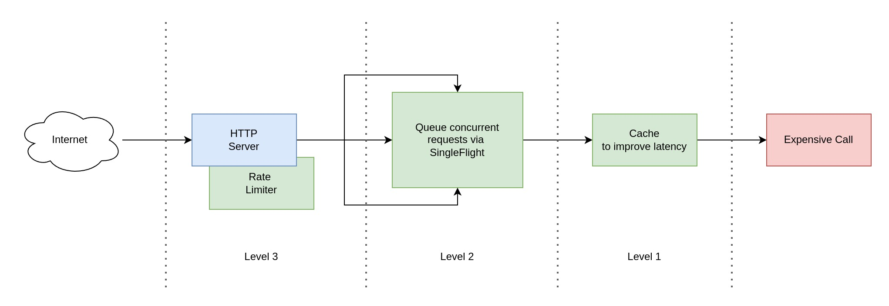

- date: 13 Dec 2024, 12:00
- slug: go-expensive-call

# Protecting Expensive Calls In Go



Imagine you are designing an API endpoint for public use which must call some critical internal function.
That function does expensive calculations. How to protect it from over-usage, what measure can we do
to balance availability and latency? Let's find out.

Source code is available at [https://github.com/lezhnev74/go_expensive_call](https://github.com/lezhnev74/go_expensive_call/blob/main/main.go).

## Prepare The API

Let's make a simple app that serves one API endpoint over HTTP and calls the expensive function.
I am using a popular package [Gin](https://gin-gonic.com/docs/introduction/) as an HTTP server here.
It exposes `GET /calculate` endpoint that we are going to abuse a little bit now :)

```go
package main

import (
	"fmt"
	"github.com/gin-gonic/gin"
	"log"
	"net/http"
	"time"
)

func ExpensiveCall() (string, error) {
	time.Sleep(time.Second)
	log.Printf("Expensive call invoked.")
	result := fmt.Sprintf("Done at %s", time.Now())
	return result, nil
}

func main() {
	r := gin.Default()

	r.GET("/calculate", func(c *gin.Context) {
		result, err := ExpensiveCall() // <-- Here is the bottleneck
		if err != nil {
			c.JSON(http.StatusBadRequest, err)
			return
		}
		c.JSON(http.StatusOK, result)
	})

	err := r.Run("0.0.0.0:8088")
	if err != nil {
		panic(err)
	}
}
```

Notice that it takes at least a second to complete the expensive function call, that is a handy trait that we will use in performance testing.
It can fail and return an error, but in our tests we won't test that branch.

Let's use [Hey](https://github.com/rakyll/hey) tool to make a few concurrent requests to our API endpoint.
For this we are going to start our app: `go run main.go` and then run Hey:

```
./hey -n 4 -c 2 http://localhost:8088/calculate

Summary:
  Total:	2.0057 secs
  Slowest:	1.0043 secs
  Fastest:	1.0010 secs
  Average:	1.0027 secs
  Requests/sec:	1.9943
...
```

It made 4 total requests with concurrency level at 2 (2 parallel requests).
It tells us that on average each request took ~1s, which is totally expected as the expensive call sleeps for 1 second.
At this point we have established our baseline - no optimizations, no protection from abusing our API.
Let's start optimizing it.

## Level-1: Cache Expensive Results

My first obvious optimization would be adding a caching layer in front of the expensive function call.
We could use a simple `map` type for that with a mutex, or use an existing package.
I preferred the latter, let's use this one: [github.com/Code-Hex/go-generics-cache](github.com/Code-Hex/go-generics-cache).

I am going to apply a bit of functional design here and wrap our expensive call into another function like that: 
```go
cacheKey := "expensive"
ttl := 10*time.Second
result, err := Cache(cacheKey, ttl, ExpensiveCall)
```
Now we can call our function with a cache key and a ttl argument that controls how long the cached result should live.
The caching code looks like this:

```go
package internal

import (
	"context"
	internalCacheVendor "github.com/Code-Hex/go-generics-cache"
	"time"
)

var internalCache *internalCacheVendor.Cache[string, string]

func InitCache() {
	internalCache = internalCacheVendor.NewContext[string, string](context.Background())
}

// cache decorates expensive data fetch call with a caching layer.
func Cache(key string, ttl time.Duration, expensiveCall func() (string, error)) (string, error) {
	var (
		val string
		err error
		ok  bool
	)

	val, ok = internalCache.Get(key)
	if ok {
		return val, nil // fast track: return from the cache
	}

	val, err = expensiveCall() // slow track: jump into the expensive call

	if err == nil {
		internalCache.Set(key, val, internalCacheVendor.WithExpiration(ttl))
	}

	return val, err
}
```

Notice the 2 functions: `InitCache` prepares the memory for cached values, while our desired function is `Cache`.
Now we can improve our endpoint code:

```go
...

internal.InitCache()

r.GET("/calculate", func(c *gin.Context) {
    cacheKey := "expensive"
    ttl := 10 * time.Second
    result, err := internal.Cache(cacheKey, ttl, ExpensiveCall) // <-- Now we use cache here
    if err != nil {
        c.JSON(http.StatusBadRequest, err)
        return
    }
    c.JSON(http.StatusOK, result)
})
...
```

Let's put some pressure again with Hey:
```
./hey -n 4 -c 2 http://localhost:8088/calculate

Summary:
  Total:	1.0036 secs
  Slowest:	1.0025 secs
  Fastest:	0.0010 secs
  Average:	0.5018 secs
  Requests/sec:	3.9855
  
  Total data:	256 bytes
  Size/request:	64 bytes

Response time histogram:
  0.001 [1]	|■■■■■■■■■■■■■■■■■■■■
  0.101 [1]	|■■■■■■■■■■■■■■■■■■■■
  0.201 [0]	|
  0.301 [0]	|
  0.402 [0]	|
  0.502 [0]	|
  0.602 [0]	|
  0.702 [0]	|
  0.802 [0]	|
  0.902 [0]	|
  1.002 [2]	|■■■■■■■■■■■■■■■■■■■■■■■■■■■■■■■■■■■■■■■■

...
```

The picture has changed! On the histogram we can see that 2 requests took 1 second, while two others were super fast and took only a fraction of it.
That tells us that our caching layer improved things a lot! We are moving in the right direction.

At this point we still have a problem which is called "Cold Cache". Until the cache contains a value, all concurrent requests hit the expensive function.
We can confirm that by looking at the app's logs, we should see multiple lines coming from the expensive function:
```
...
[GIN-debug] Listening and serving HTTP on 0.0.0.0:8088
2024/12/13 11:27:12 Expensive call invoked.
2024/12/13 11:27:12 Expensive call invoked.
...
```

I want to come up with a design which queues all concurrent requests, while just one is allowed to enter the expensive function. 
The rest must wait and use the value that first request returns. As an effect we must see this message just once: `Expensive call invoked.`.
Fortunately, there is a wonderful package for that called [Singleflight](https://pkg.go.dev/golang.org/x/sync/singleflight).
Notable it works only within the same process, in case we will run multiple app instances we would need to use a distributed queue for the same matter,
but that is out of the scope of this text.

## Level-2: Limit Concurrent Access To Expensive Function

Let's update our endpoint code with [Singleflight](https://pkg.go.dev/golang.org/x/sync/singleflight) package.
All concurrent incoming requests will queue up and wait until one of them exits from the expensive function call.

```go
...

internal.InitCache()
g := new(singleflight.Group)

r.GET("/calculate", func(c *gin.Context) {
    cacheKey := "expensive"
    ttl := 10 * time.Second
    decorated := func() (any, error) {
        return internal.Cache(cacheKey, ttl, ExpensiveCall)
    }
    result, err, _ := g.Do(cacheKey, decorated) // <-- Here it queues all the callers
    if err != nil {
        c.JSON(http.StatusBadRequest, err)
        return
    }
    c.JSON(http.StatusOK, result)
})
...
```

Here we decorate our expensive call once again (functional programming is quite handy).
Now it is wrapped in another layer which implements queueing of calls. 
Each client will block at `g.Do(...)` and wait until a single call to the expensive function returns.

Let's use Hey again:
```
./hey -n 4 -c 2 http://localhost:8088/calculate

Summary:
  Total:	1.0037 secs
  Slowest:	1.0026 secs
  Fastest:	0.0009 secs
  Average:	0.5018 secs
  Requests/sec:	3.9852
  
  Total data:	256 bytes
  Size/request:	64 bytes

Response time histogram:
  0.001 [1]	|■■■■■■■■■■■■■■■■■■■■
  0.101 [1]	|■■■■■■■■■■■■■■■■■■■■
  0.201 [0]	|
  0.301 [0]	|
  0.402 [0]	|
  0.502 [0]	|
  0.602 [0]	|
  0.702 [0]	|
  0.802 [0]	|
  0.902 [0]	|
  1.003 [2]	|■■■■■■■■■■■■■■■■■■■■■■■■■■■■■■■■■■■■■■■■
...
```

It remained the same, however our app's log shows that there was just a single message `Expensive call invoked.`. That's a win.
Two first incoming requests were queued up, one of them were in the expensive call, while the other one waiting outside.
Nice! At this point we did not improve latency, but we reduced the pressure on the expensive call! That could be crucial in real business apps.

Before we give up, maybe we can add another layer of protection from abusing our API: throttling.

## Level-3: Limit Concurrent Access To API Endpoint

Though this is not strictly needed, it also adds up to the stability of our API endpoint. We can protect the number of concurrent requests
that are allowed to hit our endpoint. We can configure our server to allow N requests In X seconds, thus implement throttling. 
This sort of optimization is used to avoid overusing our server capacity. We have already done a fair bit of protection on the previous steps,
however it is still a good practice and unlimited public use can become a problem at the most unexpected moment.

There is great package that implements throttling based on the idea of [a bucket of tokens](https://en.wikipedia.org/wiki/Token_bucket): [https://pkg.go.dev/golang.org/x/time/rate](https://pkg.go.dev/golang.org/x/time/rate).
Let's allow 1 request per second at this time, the rest should get HTTP responses with status code `419 Too Many Requests`.

```go
...

internal.InitCache()
g := new(singleflight.Group)
l := rate.NewLimiter(rate.Every(time.Second), 1)

r.GET("/calculate", func(c *gin.Context) {
    // Level-3: Throttling
    allowed := l.Allow()
    if !allowed {
        c.JSON(http.StatusTooManyRequests, nil) // <-- backoff immediately
        return
    }

    cacheKey := "expensive"
    ttl := 10 * time.Second
    decorated := func() (any, error) {
        // Level-1: Caching
        return internal.Cache(cacheKey, ttl, ExpensiveCall)
    }
    
    // Level-2: Queueing
    result, err, _ := g.Do(cacheKey, decorated) // <-- Here it queues all the callers
    if err != nil {
        c.JSON(http.StatusBadRequest, err)
        return
    }
    c.JSON(http.StatusOK, result)
})
...
```

Very nice! Now let's observe how this works:

```
./hey -n 4 -c 2 http://localhost:8088/calculate
...
Status code distribution:
  [200]	2 responses
  [429]	2 responses
...
```

We sent 4 requests totally, while using concurrency level as `2`. So not a surprise that 2 requests was rejected due to throttling.
At this point we have designed quite a durable API endpoint that protects our sensitive business function from public abuse.

I hope that was useful to you!

## References

- Gin HTTP server - https://gin-gonic.com/docs/introduction/)
- Singleflight package - https://pkg.go.dev/golang.org/x/sync/singleflight
- Rate limiter package - https://pkg.go.dev/golang.org/x/time/rate
- Hey stress tool - https://github.com/rakyll/hey