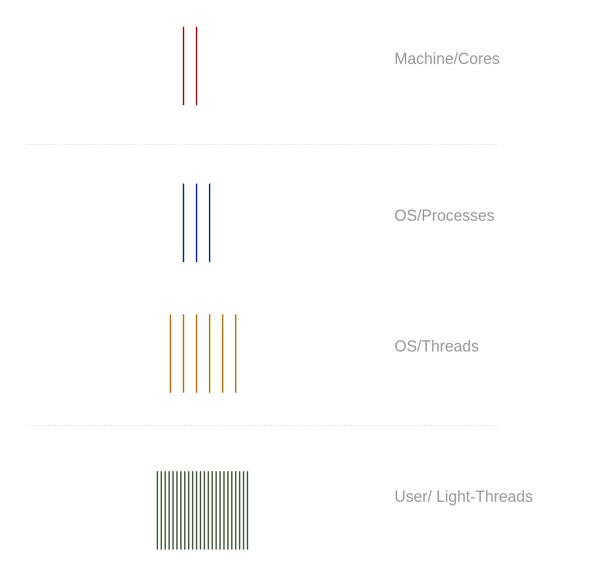

- date: 28 Feb 2025, 12:00
- slug: concurrency

# Notes On Concurrency

This abstract program has two statements, each performs a function call. Can you tell if the program is concurrent or sequential?

```
f1();
f2();
```

## Define Concurrency

**Concurrency means out-of-order execution of multiple control flows**. A control flow is an order of program instructions that a machine executes. One flow is sequential as it executes one statement
after another with respect to condition operators, iterations, goto-statements, and other control structures.

Concurrency happens when two or more flows of control execute in interleaved manner, so we can't tell what the **global order** of all instructions of all control flows will be.

Designing a program with more than one control flow is a big paradigm shift in software design (probably started to take momentum in the early 2000-s when we got mass-market multi-core CPUs, see "The
Free Lunch Is Over: A Fundamental Turn Toward Concurrency in Software"). We can compare it to other big shifts of the past: structured programming came in the late 1960s with the iconic paper "Go To
Statement Considered Harmful", then OOP became mainstream in the 1990s as a technique to create big modular systems.

Looking at the above code sample, if the functions `f1` and `f2` do not produce new control flows, then the whole program makes a single sequential flow that is not concurrent by itself. However, if
`f1()` produced a new flow and `f2()` produced another, then we might not be able to tell the global order of their execution, which makes them concurrent.

Managing Control Flows in a program depends on available tooling in your programming language and operating system. To be discussed below.

## Machines That Run Programs

Our programs are eventually compiled into a set of instructions targeting a particular abstract chip architecture (or ISA - Instruction Set Architecture). Examples of ISA would include x86, x86-64,
and ARM.

ISA is abstract and implemented by vendors and their chips. Two major players AMD and Intel produce chips supporting x86 and x86-64 instruction set architectures.

Instruction sets are fixed which means a program compiled for a given ISA should be able to run on any past or future chips that implement that ISA. Sometimes new extensions for ISAs appear, but older
programs won't be able to use them.

Since the instructions are known and fixed, CPU vendors apply aggressive optimizations to how they implement those instructions to gain more speed. Traditionally there were 3 ways:

- clock speed
- execution optimizations
- on-chip-cache.

Cache and clock speed are "simple" ways used widely to reduce latency "for free" from the program's point of view. As a new faster chip would make your program run faster without any modifications
from the developer's side. At least that is how it used to be in 2000-s.

But let's take a look at **execution optimizations**. In fact, chips could rearrange your instructions for the purpose of faster execution. Your simple sequential program compiled to simple sequential
instructions can be executed out-of-order because the chip wants to run it faster. That basically means that any program becomes concurrent even if the programmer never wanted nor thought about that.
Isn't that fascinating?

The good part is that reordering of operations is only allowed within limits. An observable behavior of a single control flow should remain the same no matter what reordering happened during the
physical execution of the instructions.

The bad part is that all bets are off when two or more instructions flow execute concurrently.
Again, concurrently means we can't guarantee the global order of instructions of both flows.

## Operating System And Control Flows

At this point, we have a picture of what is a control flow in terms of a sequence of instructions, and how a machine can execute and reorder instructions for performance.

Let's see how control flows are implemented. We write a program in a programming language and compile it to some machine language instructions, then the instructions execute on a physical machine. The
work of placing a program on (and off) a chip to run it is usually done by an operating system (OS). It is the OS that controls what program runs on which chip, and for how long, and it is the OS that
switches one flow to another to give the system responsiveness and let all flows progress.

Switchable flows of control (flows of instructions) are implemented as **threads** in modern operating systems. A thread is an abstraction that OS uses to represent a single flow of control in a
program. Whenever we run a program the OS creates a new **process** with a single **thread** in it. In different words, a process is an isolated container with resources, that include:

- isolated memory space where all data of a program resides (including the program itself, its static and dynamic data)
- various resources (like open files, sockets, etc.)
- one or more control flows in the form of threads.

A thread has a small isolated data set within the process' memory:

- an instruction pointer (points to an instruction in a shared code memory)
- a stack (individual segment of memory used for nested function calls)
- a register set (current chip's dataset)

Since threads reside in the same process they see the same process memory. That is **a key to the performance boost** that we can expect from writing concurrent programs. While having the same data in
memory we have more than one thread making calculations and thus making the progress faster.

It is worth mentioning that OS switches threads according to its scheduling strategy. Usually based on a time interval (each thread is given a time slice to run on a chip). Switching of threads takes
time as OS needs to change data associated with the thread (called context). However, switching between threads in the same process is faster as less data must be changed on the chip to run another
thread.

An even further step on this path is "user-space threads". They switch even faster as the scheduler resides in the user space and avoids many of the otherwise required system calls. The idea of these
light threads (sometimes called green threads) is about running N (possibly a big number) of user threads on top of M (small number) OS threads. Within one time slot given to an OS thread, many
user-space threads can possibly execute.

{style="max-width:500px;"}


## Concurrent Access To Shared Data

Concurrent Programming is considered a big paradigm shift, compared to Structured Programming and Object-Oriented Programming. Making concurrent programs demands building specific skills and mind
models as it opens up new kinds of problems that come with concurrent execution.

### Instructions Reordering

As we learned machines may reorder instructions to give better performance, and a single flow of control should not notice that. However, if two flows execute concurrently we can't know the global
order of their instructions partly due to reordering.

A notable example or reordering effects is shown in the picture below.
Two threads access the same data in variables `x` and `y`. The first flow writes data into the variables in the order specified by us, programmers: `x = 1` and then `y = 10`. In the other flow, we see
`x == 1` and expect to have `y` to be `10`, but that is not what we observe in reality. In fact, the instructions were reordered in the first flow without our control.

```
x = 0
y = 0

// flow-1:
x = 1
y = 10


// flow-2:
if x == 1 {
	print(y) // "0"
}

```

### Race Conditions

Race Conditions is a bad program design that assumes a certain global order of concurrent control flows while in reality, the actual order is unpredictable. Let's look at this example:

```
i = 0

# flow-1
i++

# flow-2
i++

```

A programmer can assume i to be 2 at the end of execution, however, it could be 1 as well. Why? Because a compiled program looks like this (each flow is shown on its timeline):

```
i = 0

time 	        flow-1			flow-2
-----------------------------------------------
1		tmp1 = i 		tmp2 = i
2 		tmp1 = tmp1 + 1 	tmp2 = tmp2 + 1
3		i = tmp1
4					i = tmp2
```

## Coordination Of Control Flows

To write safe and correct concurrent programs we need to coordinate flows to guarantee a certain global order of execution that can be tested and guarantees the correctness of our programs.

To enforce known order in a concurrent program we have plenty of tools:

- **Atomic operations**. Modern chips support non-dividable operations on certain data types (like integers). We could ask a chip to do some mathematical operations like "add N to a value" in a single
  atomic operation. Such operations can't be divided and thus can cause race conditions.
- **Mutexes**. For more complex types that do not support atomic operations, we can use mutexes (MUTex EXlusion). It is a data structure that allows only one concurrent flow to acquire it. The idea is
  simple: a concurrent flow must acquire a mutex, and only then do some job, and then release the mutex. Other flows must wait in the queue.
- **Message Passing**. Using mutexes creates contention as many concurrent flows can wait for a long time. That is not always desirable and we can design our programs differently to avoid such
  contention. Each flow could work only on the data that it owns, and exchange such data through messages. This design approach eliminates waiting on a mutex and greatly reduces the risk of race
  conditions. Any flow works only on its own data and no other flows can access it and create race conditions.

## Multi-Core Machines And Parallelism

Having a machine with more than 1 core (or one that supports sorcery like Hyper-Threading) we can run more than 1 flow at the same exact time. This is where real speed improvement comes from, more
work can be done at the same time. When concurrent programs run on multiple cores we call that parallelism. Parallelism is a physical condition of simultaneous execution of multiple flows. However,
simply adding more cores does not help too much. Not all programs can benefit from parallel execution (see Amdahl's Law).

By the way, concurrency is a prerequisite for parallelism, but not vice versa. To benefit from multiple chips you need multiple control flows to run on them. However, having just a single core is not
a blocker for running concurrent programs.

## Languages For Concurrency

Let's talk about some machinery that we can use to design concurrent programs. First of all, we have OS tools accessible as system calls. We can spawn new threads and processes with `fork`, or
synchronize them with `futex`, have shared memory, timers and so on. That is probably the lowest level that we can use as programmers.

However, modern languages try to help us by offering packages and built-in runtimes designed for simplifying concurrent code. One notable example is Go language which was meant to make concurrent
programming easy. It hides most of the concurrency-related machinery behind very simple interfaces: `go f1()` starts a new flow of execution for `f1()`, concurrent to the one where we called it. How
it is done is completely opaque to us programmers. It'd be cool to expect that all the concurrent problems are solved the same way, but we have to do some manual work to avoid race conditions and
other problems. Two major groups of tools that we can use in Go is mutexes and channels to exchange messages. These are the two most common techniques to deal with concurrency problems. In Go as in
other languages we can enjoy using atomics, condition variables, and garbage collection. The latter deserves extra credit, as it is almost completely opaque to us, but takes care of all the no longer
used memory that must be freed. Otherwise, how could we tell if a variable won't be visible in any other control flow, we would have to bookkeep it ourselves.

It is a balance between doing everything automatically behind simple interfaces and manual control over every detail. Some languages lean in one direction, the other in another.

I think that concludes my overview of Concurrency as a software development technique.

